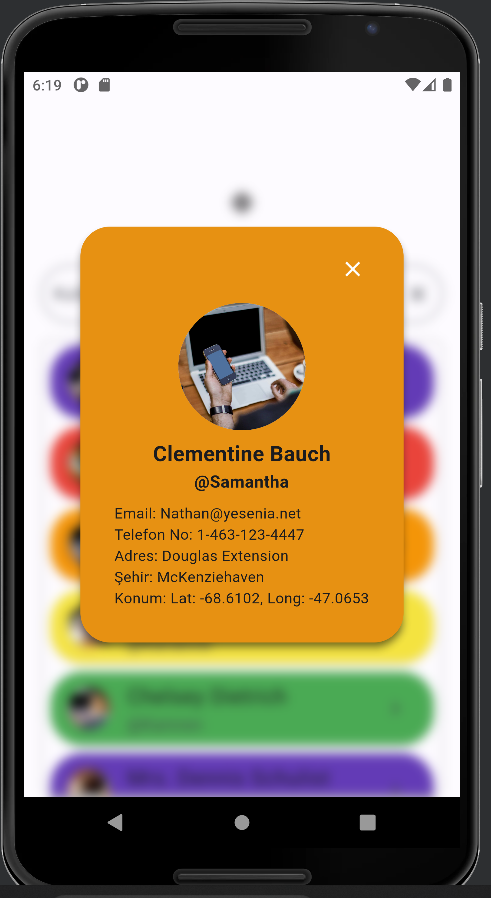

# Kullanıcı Arayüz Ekranı Uygulaması
Uygulama Akış Senaryosu
- Uygulama tek sayfadan oluşacak ve responsive olacaktır.
- Uygulamanın işlevleri
- Kullanıcılar listelenecek
- Kullanıcı detayları görüntülenecek
- Kullanıcı aranabilecek.
- Uygulama UsersPage sayfası ile başlayacaktır.

• UsersPage
- Kullanıcılar https://jsonplaceholder.typicode.com/users adresinden httprequest ile alınacaktır.
- “Kullanıcı Ara” alanına girilen karakter ile kullanıcılar, username alanına göre filtrelenip gösterilecektir.
- Arama sonucu bir kullanıcı bulunmuyorsa ekrana “Kullanıcı Bulunamadı!” yazısı basılacaktır.
- “Kullanıcı Ara” alanına girilen karakterler tamamen silindiğinde yeniden tüm kullacılar listelenecektir.
- “Kullanıcı Ara” alanına girilen karakterlerin tamamen kolayca silinebileceği bir buton eklenecektir. Kullanıcı bu butona bastığında yeniden tüm kullacılar listelenecektir.
- Kullanıcı resmi “id” alanına göre https://picsum.photos/id/{id}/info adresinden çekilecektir. (Örneğin; 5 numaralı id’yesahipkullanıcının fotoğrafını çekmek için https://picsum.photos id/5/info adresine istek yapılarak kullanıcı fotoğrafı çekilir)
- Kullanıcı listesindeki bir kullanıcı üzerine basıldığında o kullanıcıya ait detayları gösteren pop-up açılacaktır.

## Ekler

<b>Projede:</b>

-> İki ayrı Api'den veri http paketi ile veri çekilmiştir.

-> Provider paketi kullanılmıştır.

-> Animasyonlar eklenmiştir.

<b>In the project:</b>

-> Data has been fetched from two separate APIs using the HTTP package.

-> The Provider package has been utilized.

-> Animations have been added.
  

## Ekran Görüntüleri 

